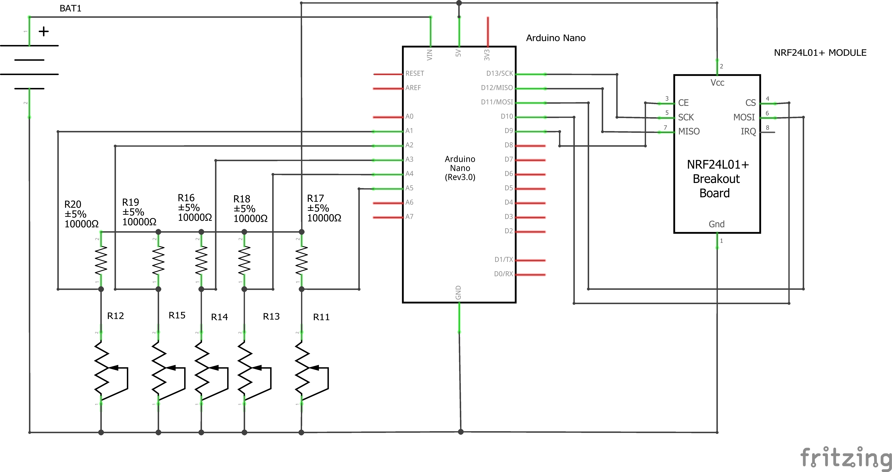
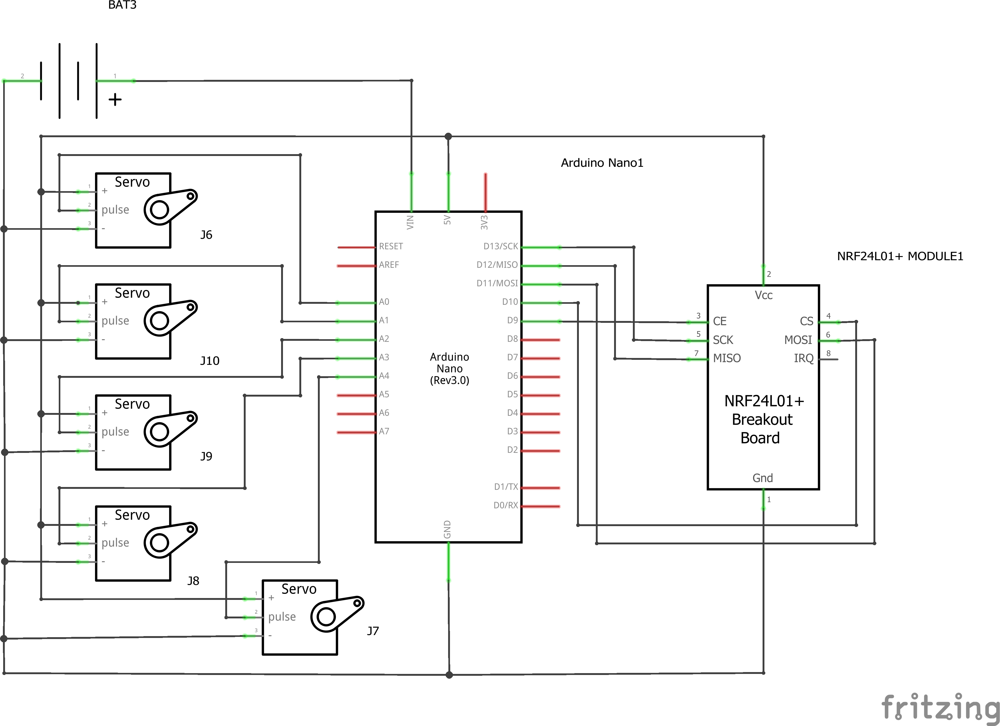

# 🤖 Robotic Hand Project with NRF24L01 Modules

This project demonstrates the use of **NRF24L01** modules to control a robotic hand ✋ with flex sensors. The transmitter reads data from flex sensors attached to a glove 🧤, and the data is wirelessly sent to the receiver. The receiver interprets the data and moves the servos on a robotic hand accordingly.

## 📚 Table of Contents
- [Project Overview](#project-overview)
- [Features](#features)
- [Materials](#materials)
- [Schematics](#schematics)
- [3D Model](#3d-model)
- [Setup](#setup)
- [Code](#code)
- [Testing](#testing)
- [Future Improvements](#future-improvements)
- [Acknowledgments](#acknowledgments)
- [License](#license)

---

## 🔍 Project Overview

The project aims to create a responsive robotic hand that mirrors the flexion of a human hand wearing a glove outfitted with flex sensors. Using NRF24L01 modules, the transmitter reads flex sensor data and sends it to the receiver, which in turn actuates servos on the robotic hand to match the movement.

### 🌟 Features
- Wireless communication between the transmitter and receiver 📡
- Control servos based on flex sensor data 🔧
- Simple calibration for flex sensors 📏
- Expandable to add more sensors or functionalities ➕

---

## 🛠️ Materials

- **2 x Arduino boards** (Uno or Mega recommended) [Amazon](https://a.co/d/7hcBaU4)
- **NRF24L01+ wireless modules** (2) [Amazon](https://a.co/d/2pLEXYt)
- **5 x Flex sensors** [Amazon](https://a.co/d/0HHEU9b)
- **5 x Servo motors MG996R** [Amazon](https://a.co/d/9qywIPb)
- **Robotic hand structure** (Viral Science YouTube Channel) [Viral Science](3d__rh_priting)
- **10k Ohm resistors** (for flex sensors) [Amazon](https://a.co/d/1EXjHHf)
- **Batteries**: LiPo (7.4V), NiMH (7.2V), or AA (rechargeable) batteries recommended. [Amazon](https://a.co/d/2NYQ9gW)
- **Fish wire** (for assembling the fingers to the motors) [Amazon](https://a.co/d/iEQPEsA)
- **Glue gun** (for securing components) [Amazon](https://a.co/d/2u9a7ZK)
- Wires and connectors [Amazon](https://a.co/d/2u9a7ZK)

---

## 🗺️ Schematics

### 📡 Transmitter

- The transmitter board reads data from five flex sensors connected to analog input pins.
- **Pins Used**:
  - **A1 - A5**: Flex sensors
  - **9 & 10**: NRF24L01 module

### 📡 Receiver

- The receiver controls five servos using the data received from the NRF24L01 module.
- **Pins Used**:
  - **2 - 6**: Servos
  - **9 & 10**: NRF24L01 module

---

## 🖨️ 3D Model

The 3D model used for the robotic hand was sourced from [Viral Science YouTube Channel](https://www.viralsciencecreativity.com/post/arduino-flex-sensor-controlled-robot-hand). You can download the model and print it on a 3D printer. Ensure it has sufficient flexibility for testing the servos and mounting the hardware.

---

## ⚙️ Setup

1. **Upload Code**:
   - Use the `transmitter.ino` code on the Arduino board connected to the flex sensors.
   - Use the `receiver.ino` code on the Arduino board controlling the servos.

2. **Connect NRF24L01 Modules**:
   - Wire up the NRF24L01+ modules according to the schematics mentioned above.
   - Power the modules using the 3.3V pin (not 5V as the NRF24L01 module is sensitive to higher voltages).

3. **Assemble the Robotic Hand**:
   - Attach the servos to the 3D printed parts as per the model’s instructions.
   - Mount the servos and run the flex sensor wires to the transmitter module.
   - Use fish wire to connect the fingers to the motors for movement.
   - Secure components with a glue gun as necessary.

4. **Calibrate Flex Sensors**:
   - Use the `map()` function in the `transmitter.ino` code to adjust the range of flex sensor values.
   - Test the sensor readings in the Serial Monitor to ensure the values are correct.

---

## 💻 Code

This repository contains the following files:
- `transmitter.ino`: Code for reading flex sensor data and transmitting it via NRF24L01.
- `receiver.ino`: Code for receiving flex sensor data and controlling the servos.
- `test_sensors.ino`: Code for testing sensor values and printing them to the Serial Monitor.

---

## 🧪 Testing

Below is a quick demonstration of the robotic hand in action.

---

## 📸 Photos

### 🛠️ Sensors Testing

### 🧤 Bending Testing

---

## 🚀 Future Improvements

- Add more advanced control algorithms for smoother servo movements.
- Use better-quality servos for a more lifelike hand movement.
- Implement haptic feedback on the glove to feel the robotic hand's grip.
- Improve range and reliability of the NRF24L01 modules by adding external antennas.

---

## 🙏 Acknowledgments

This project was made possible by:
- [Viral Science](https://www.viralsciencecreativity.com/post/arduino-flex-sensor-controlled-robot-hand) for providing the 3D model of the robotic hand.
- The open-source community for developing libraries such as `RF24` and `Servo`.

---

## 📄 License

This project is open-source under the MIT license. Feel free to contribute and share your improvements!
